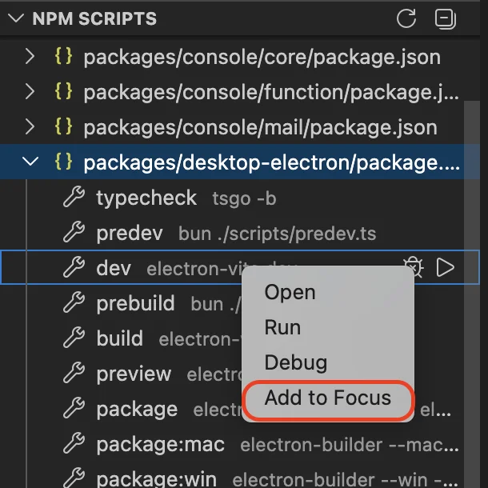
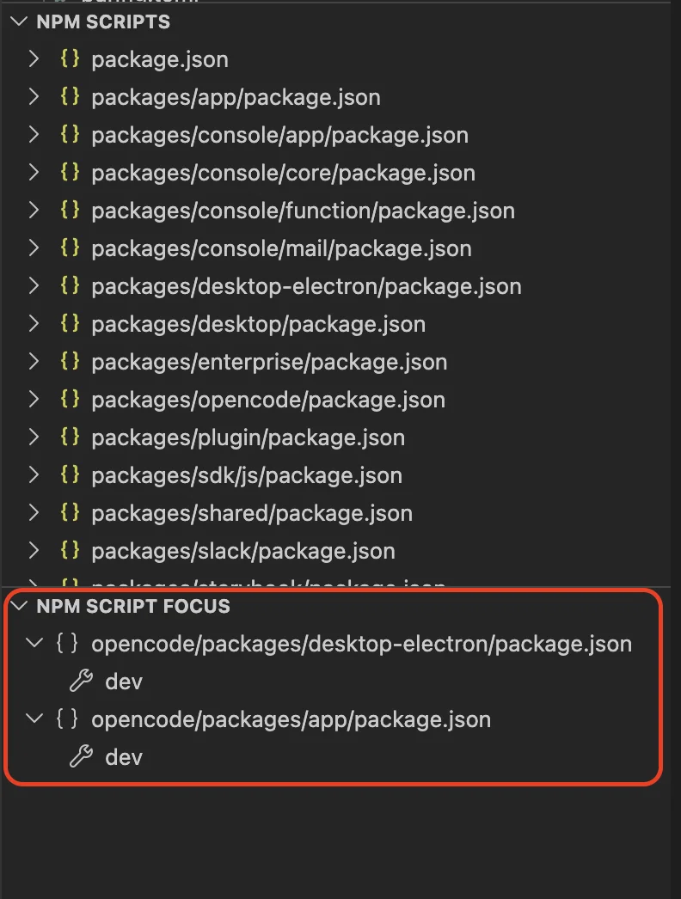
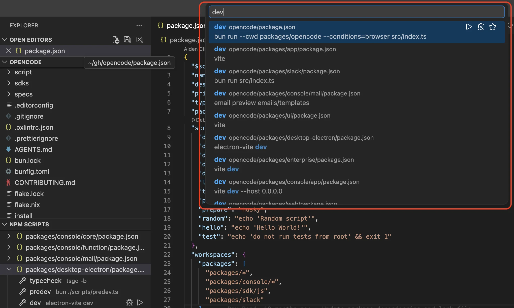

# npm Scripts Focus

Focus on npm scripts you care about and rerun them quickly.

Monorepos often expose hundreds of npm scripts across many packages, but day to day you only work with a handful. This extension lets you pin just the ones you care about so they are always one click away, instead of scrolling through the full list every time.

## Features

### Add to Focus

Add scripts from the built-in npm view to a focused list.



### Run with One Click

Run, debug, and rerun focused scripts with one click.



### Search Scripts

Search and quickly jump to any script across your workspace.



## Install via CLI

```bash
code --install-extension zjffun.vscode-npm-scripts-focus
```

## [Release Notes](./CHANGELOG.md)
